# n8n Workflow Automation

Automated resume deployment workflow using n8n (https://n8n.jclee.me).

> **⚠️ Internal Service**: `n8n.jclee.me`, `loki.jclee.me`, and `prometheus.jclee.me` are internal-only domains. Ensure you are connected to the internal network or VPN.

> **📖 See also**:
>
> - **[Infrastructure Architecture](../docs/guides/INFRASTRUCTURE.md#5-n8n-workflow-automation)** - n8n service details, configuration, and deployment workflow
> - **[Monitoring Setup Guide](../docs/guides/MONITORING_SETUP.md)** - Integration with Prometheus, Grafana, and Loki

## Overview

This workflow automates the entire resume deployment pipeline:

1. **GitHub Webhook Trigger** - Listens for push events to master branch
2. **Git Pull** - Updates local repository
3. **Build** - Generates worker.js from source files
4. **Unit Tests** - Runs Jest tests
5. **E2E Tests** - Runs Playwright tests
6. **Deploy** - Deploys to Cloudflare Workers
7. **Health Check** - Verifies deployment
8. **Notifications** - Sends Slack alerts and logs to Loki

## Quick Start

### 1. Get n8n API Key

```bash
# Visit: https://n8n.jclee.me/settings/api
# Create new API key
# Copy the key (shown only once)
```

### 2. Set Environment Variables

```bash
# Add to ~/.env
export N8N_URL="https://n8n.jclee.me"
export N8N_API_KEY="your-api-key-here"
export SLACK_WEBHOOK_URL="your-slack-webhook-url"

# Load environment
source ~/.env
```

### 3. Deploy Workflow

```bash
cd ~/apps/resume
chmod +x n8n/deploy-workflow.sh
./n8n/deploy-workflow.sh
```

**Expected output:**

```
[INFO] === n8n Workflow Deployment ===
[INFO] Target: https://n8n.jclee.me
[INFO] Workflow: n8n/workflows/resume-auto-deploy.json

[INFO] Testing n8n API connection...
[INFO] Connection successful!
[INFO] Checking for existing workflow: Resume Auto Deploy
[INFO] Creating new workflow...
[INFO] Workflow created successfully!
{
  "id": "abc123",
  "name": "Resume Auto Deploy",
  "active": true,
  "createdAt": "2025-11-20T00:00:00.000Z",
  "updatedAt": "2025-11-20T00:00:00.000Z"
}
[INFO] Activating workflow...
[INFO] Workflow activated successfully!
[INFO] Getting webhook URL...
[INFO] Webhook URL: https://n8n.jclee.me/webhook/resume-deploy

[INFO] Configure GitHub webhook:
[INFO]   Repository: http://gitlab.jclee.me/jclee/resume
[INFO]   Settings → Webhooks → Add webhook
[INFO]   Payload URL: https://n8n.jclee.me/webhook/resume-deploy
[INFO]   Content type: application/json
[INFO]   Events: Just the push event

[INFO] === Deployment Complete ===
[INFO] Workflow ID: abc123
[INFO] Dashboard: https://n8n.jclee.me/workflow/abc123
```

### 4. Configure GitHub Webhook

```bash
# Go to: http://gitlab.jclee.me/jclee/resume/settings/hooks
# Click: Add webhook

# Payload URL: https://n8n.jclee.me/webhook/resume-deploy
# Content type: application/json
# Secret: (optional, for signature verification)
# SSL verification: Enable
# Events: Just the push event
# Active: ✓
```

### 5. Test Workflow

```bash
# Make a test change
echo "# Test" >> README.md
git add README.md
git commit -m "test: trigger n8n workflow"
git push origin master

# Check n8n dashboard
# Visit: https://n8n.jclee.me/executions

# Check Slack for notification
# Check Loki logs
curl https://loki.jclee.me/loki/api/v1/query \
  -G --data-urlencode 'query={job="resume-deploy"}' | jq
```

## Available Workflows

### 1. Resume Auto Deploy (GitHub Webhook)

Automated deployment pipeline triggered by GitHub push events.

**Workflow File**: `workflows/resume-auto-deploy.json`

**Features**:

- GitHub webhook trigger
- Automated build and test
- Cloudflare Workers deployment
- Slack notifications
- Loki logging

### 2. Health Check Monitor

Periodic health monitoring for resume.jclee.me.

**Workflow File**: `resume-healthcheck-workflow.json`

**Features**:

- Runs every 5 minutes
- HTTP health check to `/health` endpoint
- Slack alert on downtime/errors
- Uses Slack Webhook URL

**Quick Setup**:

```bash
# 1. Import workflow to n8n.jclee.me
# 2. Update "Set Slack Webhook URL" node with registered credential
# 3. Activate workflow
```

**Monitoring Details**:

- Health check interval: 5 minutes
- Timeout: 10 seconds
- Error conditions: Non-200 status code OR timeout
- Alert format: Slack Block Kit with status, time, error details

### 3. Health Check Monitor (OAuth2) ⭐ RECOMMENDED

OAuth2-based health monitoring with secure credential management.

**Workflow File**: `resume-healthcheck-oauth2.json`

**Workflow ID**: `yCWYRtQsXNIsENi1`

**URL**: https://n8n.jclee.me/workflow/yCWYRtQsXNIsENi1

**Why OAuth2?**

- 🔒 Credentials stored securely in n8n (not in workflow JSON)
- 🔄 Automatic token refresh
- 🚫 No hardcoded webhook URLs
- ✅ Better access control and auditing

**Features**:

- Runs every 5 minutes
- HTTP health check to `/health` endpoint
- Slack alert on downtime/errors
- **Uses Slack OAuth2 API credential** (registered in n8n)
- Cleaner workflow (no "Set Webhook URL" node needed)

**Quick Setup**:

```bash
# 1. Set up Slack OAuth2 credential (see SLACK_OAUTH2_SETUP.md)
# 2. Import workflow to n8n or use existing workflow ID
# 3. Activate workflow via n8n UI
```

**Credential Setup**: See [SLACK_OAUTH2_SETUP.md](SLACK_OAUTH2_SETUP.md) for detailed instructions.

**Workflow Flow**:

```
Schedule Trigger (5 min)
  → HTTP Request (health check)
  → IF (is down?)
  → Slack OAuth2 (send alert)
```

**Monitoring Details**:

- **Target**: https://resume.jclee.me/health
- **Frequency**: Every 5 minutes
- **Timeout**: 10 seconds
- **Alert Conditions**: HTTP != 200 or timeout
- **Notification**: Slack with detailed error info

**Workflow Flow**:

```
Every 5 Minutes → Check Health → Is Down? → Set Webhook → Slack Alert
```

See `resume-healthcheck-workflow.json` for full configuration.

---

## Workflow Architecture (Auto Deploy)

```mermaid
graph LR
    A[GitHub Push] -->|Webhook| B[n8n Trigger]
    B --> C{Master Branch?}
    C -->|Yes| D[Git Pull]
    C -->|No| Z[Skip]
    D --> E[npm run build]
    E --> F[npm test]
    F --> G[npm run test:e2e]
    G --> H[wrangler deploy]
    H --> I[Health Check]
    I -->|Success| J[Slack ✅]
    I -->|Failure| K[Slack ❌]
    J --> L[Log to Loki]
    K --> L
    L --> M[Webhook Response]
```



## Workflow Nodes

| Node                 | Type               | Purpose                    | Command/Config                        |
| -------------------- | ------------------ | -------------------------- | ------------------------------------- |
| GitHub Webhook       | Trigger            | Listen for push events     | Path: `/webhook/resume-deploy`        |
| Filter Master Branch | IF                 | Only process master branch | Condition: `ref == refs/heads/master` |
| Git Pull             | Execute Command    | Update repository          | `git pull origin master`              |
| Build Worker         | Execute Command    | Generate worker.js         | `npm run build`                       |
| Run Tests            | Execute Command    | Unit tests                 | `npm test`                            |
| Run E2E Tests        | Execute Command    | E2E tests                  | `npm run test:e2e`                    |
| Deploy to Cloudflare | Execute Command    | Deploy worker              | `wrangler deploy`                     |
| Health Check         | HTTP Request       | Verify deployment          | GET `/health`                         |
| Slack Success        | HTTP Request       | Success notification       | POST to Slack webhook                 |
| Slack Failure        | HTTP Request       | Failure notification       | POST to Slack webhook                 |
| Log to Loki          | HTTP Request       | Log to Grafana Loki        | POST to Loki API                      |
| Webhook Response     | Respond to Webhook | Return status to GitHub    | JSON response                         |

## Environment Variables

Required in n8n settings or workflow:

```bash
# Slack webhook (for notifications)
SLACK_WEBHOOK_URL=https://hooks.slack.com/services/YOUR/WEBHOOK/URL

# GitHub credentials (if needed)
GITHUB_TOKEN=ghp_xxxxxxxxxxxxxxxxxxxx

# Cloudflare credentials (for wrangler)
CLOUDFLARE_API_TOKEN=your-cloudflare-api-token
CLOUDFLARE_ACCOUNT_ID=your-account-id
```

## Monitoring

### Check Workflow Status

```bash
# List all workflows
curl -s -H "X-N8N-API-KEY: $N8N_API_KEY" \
  https://n8n.jclee.me/api/v1/workflows | jq

# Get specific workflow
curl -s -H "X-N8N-API-KEY: $N8N_API_KEY" \
  https://n8n.jclee.me/api/v1/workflows/{workflow-id} | jq

# List executions
curl -s -H "X-N8N-API-KEY: $N8N_API_KEY" \
  https://n8n.jclee.me/api/v1/executions | jq
```

### Check Logs

```bash
# Loki logs (last 1 hour)
curl -s 'https://loki.jclee.me/loki/api/v1/query_range' \
  --data-urlencode 'query={job="resume-deploy"}' \
  --data-urlencode "start=$(date -d '1 hour ago' +%s)000000000" \
  --data-urlencode "end=$(date +%s)000000000" | \
  jq -r '.data.result[].values[][1]'

# Grafana dashboard
# Visit: https://grafana.jclee.me/d/resume-deploy
```

### Metrics

```bash
# Prometheus metrics
curl -s https://resume.jclee.me/metrics | grep -E '^(requests|errors|response_time)'

# Example output:
# requests_total{method="GET",path="/"} 12345
# errors_total{method="GET",path="/",status="500"} 0
# response_time_ms{method="GET",path="/"} 45.2
```

## Troubleshooting

### Workflow Not Triggering

**Problem**: GitHub webhook sent but workflow didn't run

**Check**:

```bash
# 1. Verify webhook URL
curl https://n8n.jclee.me/webhook/resume-deploy

# 2. Check GitHub webhook deliveries
# Visit: http://gitlab.jclee.me/jclee/resume/settings/hooks
# Click on webhook → Recent Deliveries

# 3. Check n8n logs
# Visit: https://n8n.jclee.me/executions
# Filter by workflow: "Resume Auto Deploy"
```

**Solution**:

- Ensure webhook URL is correct: `https://n8n.jclee.me/webhook/resume-deploy`
- Check if workflow is active in n8n
- Verify GitHub can reach n8n.jclee.me (firewall/DNS)

### Build/Test Failures

**Problem**: Deployment fails at build or test step

**Check**:

```bash
# Check execution logs in n8n
# Visit: https://n8n.jclee.me/executions/{execution-id}

# Test locally
cd ~/apps/resume
npm run build
npm test && npm run test:e2e
```

**Solution**:

- Fix failing tests/build locally
- Push fix to master
- Workflow will auto-retry

### Permission Errors

**Problem**: `permission denied` errors in Execute Command nodes

**Solution**:

```bash
# Ensure n8n has access to repository
sudo chown -R n8n:n8n /home/jclee/apps/resume

# Or run n8n as jclee user
# Configure in docker-compose.yml:
# user: "1000:1000"  # jclee UID:GID
```

### Slack Notifications Not Sent

**Problem**: Workflow completes but no Slack notification

**Check**:

```bash
# Test webhook manually
curl -X POST $SLACK_WEBHOOK_URL \
  -H 'Content-Type: application/json' \
  -d '{"text": "Test from n8n workflow"}'
```

**Solution**:

- Verify `SLACK_WEBHOOK_URL` is set in n8n
- Check Slack webhook is not revoked
- Ensure n8n can reach hooks.slack.com

## Advanced Features

### Conditional Deployment (QA/Production)

Modify workflow to deploy to different environments based on branch:

```json
{
  "parameters": {
    "conditions": {
      "string": [
        {
          "value1": "={{ $json.ref }}",
          "operation": "equals",
          "value2": "refs/heads/qa"
        }
      ]
    }
  },
  "name": "Check Branch",
  "type": "n8n-nodes-base.switch"
}
```

### Rollback on Failure

Add rollback node after deployment failure:

```json
{
  "parameters": {
    "command": "cd /home/jclee/apps/resume && git reset --hard HEAD~1 && npm run deploy"
  },
  "name": "Rollback Deployment",
  "type": "n8n-nodes-base.executeCommand"
}
```

### Performance Metrics Collection

Add Prometheus metrics collection:

```json
{
  "parameters": {
    "url": "https://prometheus.jclee.me/api/v1/write",
    "sendBody": true,
    "bodyParameters": {
      "parameters": [
        {
          "name": "metrics",
          "value": "={{ { deployment_duration_seconds: Date.now() - $('GitHub Webhook').item.json.timestamp } }}"
        }
      ]
    }
  },
  "name": "Collect Metrics",
  "type": "n8n-nodes-base.httpRequest"
}
```

## API Reference

### Deploy Workflow

```bash
curl -X POST https://n8n.jclee.me/api/v1/workflows \
  -H "X-N8N-API-KEY: $N8N_API_KEY" \
  -H "Content-Type: application/json" \
  -d @n8n/workflows/resume-auto-deploy.json
```

### Update Workflow

```bash
curl -X PATCH https://n8n.jclee.me/api/v1/workflows/{workflow-id} \
  -H "X-N8N-API-KEY: $N8N_API_KEY" \
  -H "Content-Type: application/json" \
  -d @n8n/workflows/resume-auto-deploy.json
```

### Activate/Deactivate

```bash
# Activate
curl -X PATCH https://n8n.jclee.me/api/v1/workflows/{workflow-id} \
  -H "X-N8N-API-KEY: $N8N_API_KEY" \
  -H "Content-Type: application/json" \
  -d '{"active": true}'

# Deactivate
curl -X PATCH https://n8n.jclee.me/api/v1/workflows/{workflow-id} \
  -H "X-N8N-API-KEY: $N8N_API_KEY" \
  -H "Content-Type: application/json" \
  -d '{"active": false}'
```

### Delete Workflow

```bash
curl -X DELETE https://n8n.jclee.me/api/v1/workflows/{workflow-id} \
  -H "X-N8N-API-KEY: $N8N_API_KEY"
```

## Security Best Practices

1. **API Key Security**:
   - Store API key in `.env` (gitignored)
   - Rotate key every 90 days
   - Never commit to Git

2. **Webhook Verification**:
   - Use GitHub webhook secret
   - Verify signature in n8n
   - Filter by branch/repository

3. **Command Injection Prevention**:
   - Validate all inputs
   - Use parameterized commands
   - Escape special characters

4. **Least Privilege**:
   - Run n8n with minimal permissions
   - Separate credentials per environment
   - Audit access logs regularly

## Related Documentation

- [n8n Documentation](https://docs.n8n.io)
- [n8n API Reference](https://docs.n8n.io/api/)
- [GitHub Webhooks](https://docs.github.com/en/webhooks)
- [Cloudflare Workers](https://developers.cloudflare.com/workers/)
- [Grafana Loki](https://grafana.com/docs/loki/)
- [Prometheus](https://prometheus.io/docs/)

## Support

- **n8n Instance**: https://n8n.jclee.me
- **Documentation**: ~/apps/resume/docs/
- **Issues**: http://gitlab.jclee.me/jclee/resume/issues
- **Contact**: qws941@kakao.com
