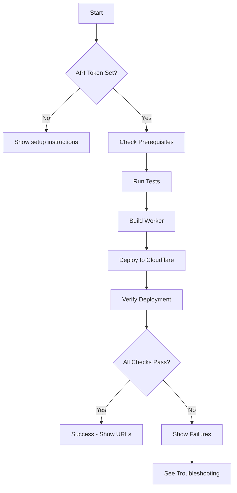

# Deployment Scripts

Automation scripts for deploying the resume portfolio to Cloudflare Workers.

## Scripts Overview

### `quick-deploy.sh` ⭐ RECOMMENDED

**Purpose**: One-command deployment with all checks
**Prerequisites**: `CLOUDFLARE_API_TOKEN` environment variable

```bash
export CLOUDFLARE_API_TOKEN=your_token_here
./scripts/deployment/quick-deploy.sh
```

**What it does**:

1. Validates `CLOUDFLARE_API_TOKEN` is set
2. Runs `deploy-helper.sh` for deployment
3. Runs `verify-deployment.sh` for validation
4. Shows production URLs and next steps

**Use when**: You want the simplest, most automated deployment experience

---

### `deploy-helper.sh`

**Purpose**: Step-by-step deployment with progress indicators
**Prerequisites**: `CLOUDFLARE_API_TOKEN` environment variable

```bash
export CLOUDFLARE_API_TOKEN=your_token_here
./scripts/deployment/deploy-helper.sh
```

**What it does** (6 stages):

1. **Check prerequisites**: Validate Node.js, npm, git
2. **Run tests**: Execute unit + E2E tests
3. **Build worker**: Generate worker.js with timestamp
4. **Check git status**: Warn if uncommitted changes
5. **Deploy**: Push to Cloudflare Workers
6. **Verify**: Basic health and metrics checks

**Use when**: You want detailed progress output and control at each stage

---

### `verify-deployment.sh`

**Purpose**: Comprehensive deployment verification (7 checks)
**Prerequisites**: None (read-only, no credentials needed)

```bash
./scripts/verification/verify-deployment.sh
```

**What it checks** (7 tests):

1. **Deployment timestamp**: Health endpoint, version, status
2. **Open Graph image**: HTTP 200, valid PNG, correct dimensions (1200x630)
3. **OG meta tags**: og:image, og:image:width, og:image:height, og:image:type
4. **Web Vitals tracking**: observeLCP, observeFID, observeCLS functions
5. **Vitals endpoint**: POST /api/vitals responds with HTTP 200
6. **Security headers**: CSP, HSTS, X-Content-Type-Options
7. **Prometheus metrics**: http_requests_total, http_response_time_seconds, vitals_received_total

**Output**:

- ✓ Passed: X/7
- ⚠ Warnings: X
- ✗ Failed: X/7

**Use when**:

- Verifying existing deployment
- Troubleshooting deployment issues
- Checking deployment status without credentials

---

## Quick Reference

| Task                   | Command                          | Requires Credentials |
| ---------------------- | -------------------------------- | -------------------- |
| Deploy with all checks | `./scripts/quick-deploy.sh`      | ✅ Yes (API token)   |
| Deploy step-by-step    | `./scripts/deploy-helper.sh`     | ✅ Yes (API token)   |
| Verify only            | `./scripts/verify-deployment.sh` | ❌ No (read-only)    |

## Getting Cloudflare API Token

### Option 1: Interactive Login (Easiest)

```bash
cd typescript/portfolio-worker
npx wrangler login
# Opens browser for authentication
```

### Option 2: API Token (Best for CI/CD)

1. Go to [Cloudflare Dashboard](https://dash.cloudflare.com/)
2. Navigate: My Profile → API Tokens → Create Token
3. Use template: "Edit Cloudflare Workers"
4. Copy token and set environment variable:

   ```bash
   export CLOUDFLARE_API_TOKEN=your_token_here

   # Make persistent (add to ~/.bashrc)
   echo 'export CLOUDFLARE_API_TOKEN=your_token_here' >> ~/.bashrc
   source ~/.bashrc
   ```

## Deployment Flow



## Troubleshooting

### Error: "CLOUDFLARE_API_TOKEN not set"

**Solution**: Set environment variable before running scripts

```bash
export CLOUDFLARE_API_TOKEN=your_token_here
```

### Error: "Unable to authenticate request [code: 10001]"

**Cause**: API token invalid or insufficient permissions
**Solution**:

1. Generate new token at Cloudflare Dashboard
2. Ensure token has "Edit Cloudflare Workers" permissions
3. Set new token: `export CLOUDFLARE_API_TOKEN=new_token`

### Error: Tests failing

**Solution**: Fix test failures before deployment

```bash
npm test          # Run unit tests
npm run test:e2e  # Run E2E tests
```

### Verification checks failing

**Solution**: Check specific failure in `verify-deployment.sh` output

- Timestamp not recent? Wait a few minutes for propagation
- OG image 404? Check if `npm run build` was run
- Missing meta tags? Check `typescript/portfolio-worker/index.html` has OG tags
- Vitals endpoint failing? Check worker routing in `generate-worker.js`

## Full Deployment Guide

For detailed instructions including GitHub authentication setup, SSH key configuration, and comprehensive troubleshooting, see:

📘 **[Manual Deployment Guide](../docs/MANUAL_DEPLOYMENT_GUIDE.md)**

Includes:

- 3 deployment options (GitHub PAT, Wrangler, SSH)
- Step-by-step credential setup
- 7-step verification checklist
- 6 troubleshooting scenarios
- Social media preview testing
- Recommendations (immediate, short-term, long-term)

---

**Last Updated**: 2025-11-11T21:30:00Z
**Maintainer**: OpenCode AI Assistant
**Version**: 1.0.0
