# Architecture Diagrams

Visual representations of the job-automation workers system, request flows, and component interactions.

## Table of Contents

1. [System Architecture](#system-architecture)
2. [Request Flow Sequence](#request-flow-sequence)
3. [Workflow Execution Timeline](#workflow-execution-timeline)
4. [Authentication Flow](#authentication-flow)
5. [Rate Limiting Algorithm](#rate-limiting-algorithm)

---

## System Architecture

High-level overview of all major components and their relationships:

```mermaid
graph TB
    subgraph Client["Client Layer"]
        Browser["🌐 Browser"]
        MCP["🔧 MCP Server"]
        CLI["💻 CLI Tool"]
    end

    subgraph Worker["Cloudflare Worker"]
        Fetch["Fetch Handler"]
        Middleware["Middleware Stack<br/>7 Layers"]
        Router["Router<br/>30+ Endpoints"]
        Handlers["Handler Classes<br/>8 Handlers"]
    end

    subgraph Services["Service Layer"]
        Auth["AuthService"]
        Stats["StatsService"]
        Apps["ApplicationsService"]
        Workflows["WorkflowService"]
    end

    subgraph Storage["Storage & Persistence"]
        D1["📊 D1 Database<br/>3 Tables"]
        KV["⚡ KV Storage<br/>3 Namespaces"]
        R2["📦 R2 Bucket<br/>Screenshots"]
    end

    subgraph External["External Services"]
        Slack["🔔 Slack Notifications"]
        CF["☁️ Cloudflare API"]
        Webhooks["🪝 Webhooks"]
    end

    Browser -->|HTTP Request| Fetch
    MCP -->|API Calls| Fetch
    CLI -->|Worker Commands| Fetch

    Fetch --> Middleware
    Middleware --> Router
    Router --> Handlers

    Handlers --> Auth
    Handlers --> Stats
    Handlers --> Apps
    Handlers --> Workflows

    Auth --> KV
    Auth --> D1
    Stats --> D1
    Apps --> D1
    Apps --> R2

    Workflows --> Slack
    Workflows --> CF
    Browser -.->|Webhooks| Webhooks

    style Client fill:#e1f5ff
    style Worker fill:#fff3e0
    style Services fill:#f3e5f5
    style Storage fill:#e8f5e9
    style External fill:#fce4ec
```



### Component Descriptions

**Client Layer**:

- **Browser**: Frontend dashboard accessing `/job/*` routes
- **MCP Server**: Tool interface for job application automation
- **CLI Tool**: Command-line deployment and management

**Cloudflare Worker**:

- **Fetch Handler**: Entry point, strips `/job` prefix, dispatches to routing
- **Middleware Stack**: 7 layers (logger, CORS, rate limit, CSRF, auth, handler, response)
- **Router**: Maps 30+ API endpoints to appropriate handlers
- **Handler Classes**: 8 handler classes (Applications, Auth, Stats, Webhooks, etc.)

**Service Layer**:

- **AuthService**: JWT generation, token validation, session management
- **StatsService**: Statistics aggregation, report generation
- **ApplicationsService**: Job application CRUD operations
- **WorkflowService**: Workflow triggering and monitoring

**Storage**:

- **D1 Database**: applications, job_cache, sync_logs tables
- **KV Storage**: SESSIONS (24h TTL), RATE_LIMIT_KV (60s TTL), NONCE_KV (24h TTL)
- **R2 Bucket**: Screenshot storage for job listings

**External Services**:

- **Slack**: Error notifications, status reports
- **Cloudflare API**: Direct API access for advanced operations
- **Webhooks**: Outbound notifications for external integrations

---

## Request Flow Sequence

Detailed sequence diagram showing how a request flows through the entire system:

```mermaid
sequenceDiagram
    participant Client as 🌐 Client
    participant Fetch as Fetch Handler
    participant Logger as Logger Middleware
    participant CORS as CORS Middleware
    participant RateLimit as Rate Limit
    participant Auth as Auth Middleware
    participant Handler as Handler Instance
    participant Service as Service Layer
    participant Database as D1 Database
    participant Response as Response Logger

    Client->>Fetch: HTTP Request<br/>/job/api/applications
    Fetch->>Fetch: Strip /job prefix<br/>/api/applications
    Fetch->>Logger: Pass request

    Logger->>Logger: Log request (ECS format)
    Logger->>CORS: Continue

    CORS->>CORS: Validate origin<br/>Add CORS headers
    CORS->>RateLimit: Continue

    RateLimit->>RateLimit: Check token bucket<br/>IP: 203.0.113.42
    RateLimit->>RateLimit: Decrement token count<br/>59/60 remaining
    RateLimit->>Auth: Continue (if tokens available)

    Auth->>Auth: Extract Bearer token<br/>from Authorization header
    Auth->>Auth: Validate JWT signature<br/>Check expiration (24h)
    Auth->>Handler: Continue (if valid)

    Handler->>Handler: Parse request body<br/>Validate schema
    Handler->>Service: Call getApplications(page=1)

    Service->>Database: SELECT * FROM applications<br/>LIMIT 50 OFFSET 0
    Database->>Database: Query execution<br/>4.5ms
    Database->>Service: Return 42 rows

    Service->>Service: Format response<br/>Add pagination metadata
    Service->>Handler: Return results

    Handler->>Handler: Build response JSON
    Handler->>Response: Pass response

    Response->>Response: Log response (ECS format)<br/>Status: 200<br/>Duration: 12ms<br/>Size: 8.2KB
    Response->>Client: HTTP 200 OK<br/>Content-Type: application/json<br/>Access-Control-Allow-Origin: *

    Client->>Client: Parse JSON<br/>Render UI

    style Client fill:#e1f5ff
    style Fetch fill:#fff3e0
    style Logger fill:#ffe0b2
    style CORS fill:#ffe0b2
    style RateLimit fill:#ffe0b2
    style Auth fill:#ffe0b2
    style Handler fill:#f3e5f5
    style Service fill:#f3e5f5
    style Database fill:#e8f5e9
    style Response fill:#ffe0b2
```

### Key Points

1. **Request Transformation**: `/job/api/applications` → `/api/applications`
2. **Middleware Chain**: Each layer can reject or modify the request
3. **Token Bucket**: Rate limiting uses token-per-second refill (60 req/min = 1 token/sec)
4. **JWT Validation**: Tokens expire after 24 hours, require refresh
5. **ECS Logging**: All logs include @timestamp, duration, status, response size
6. **Database Query**: Average 4-5ms per query (simple SELECT)

---

## Workflow Execution Timeline

Sequence of events during a scheduled or triggered workflow:

```mermaid
timeline
    title Workflow Execution: Daily Report (0 9 * * *)

    section Schedule
        09:00 UTC : Event trigger fires
        09:00:100ms : Workflow instance created
        09:00:200ms : Load workflow definition
        09:00:300ms : Authenticate workflow

    section Execution Phase 1
        09:00:400ms : Step 1 - Fetch statistics
        09:00:500ms : Query D1 (SELECT COUNT)
        09:00:700ms : Step 1 complete (200ms)

    section Execution Phase 2
        09:00:700ms : Step 2 - Format report
        09:00:800ms : Process template
        09:00:900ms : Step 2 complete (200ms)

    section Execution Phase 3
        09:00:900ms : Step 3 - Send Slack notification
        09:01:100ms : Call Slack API
        09:01:500ms : Step 3 complete (600ms)

    section Completion
        09:01:500ms : Store execution record
        09:01:600ms : Workflow success
        09:01:700ms : Log completion (ECS format)

    section Error Handling (if failure)
        09:02:000ms : Catch error handler
        09:02:100ms : Send error notification
        09:02:500ms : Workflow failed
```

### Timeline Breakdown

**Schedule Phase** (300ms):

- Workflow trigger fires at scheduled time
- Workflow infrastructure initializes
- Authentication tokens validated

**Execution Phase 1** (200ms):

- Fetch statistics from D1
- Count applications by status
- Calculate totals and percentages

**Execution Phase 2** (200ms):

- Format data into report template
- Add charts/graphs (if applicable)
- Prepare for transmission

**Execution Phase 3** (600ms):

- Call Slack API webhook
- Slack server processes message
- Confirm delivery (200ms, mostly network latency)

**Completion Phase** (200ms):

- Store execution record in D1
- Log success event
- Update workflow status

**Error Handling** (varies):

- If any step fails, catch handler triggers
- Send error notification to Slack
- Mark workflow as failed
- Log full error details

---

## Authentication Flow

Complete authentication and session lifecycle:

```mermaid
graph TD
    Start["🔐 Authentication Start"] --> CheckCookie{"Cookie<br/>Present?"}

    CheckCookie -->|Yes| ValidateCookie{"JWT<br/>Valid?"}
    CheckCookie -->|No| Login["Redirect to<br/>/api/auth/login"]

    ValidateCookie -->|Yes| CheckExpiration{"Token<br/>Expiring<br/>Soon?"}
    ValidateCookie -->|No| ClearSession["Clear invalid<br/>session"]
    ClearSession --> Login

    CheckExpiration -->|Yes| Refresh["Call refresh endpoint<br/>/api/auth/refresh"]
    CheckExpiration -->|No| Authenticated["✅ Authenticated"]

    Refresh --> GenerateNewToken["Generate new JWT<br/>exp: now + 24h"]
    GenerateNewToken --> StoreSession["Store in KV<br/>SESSIONS namespace<br/>TTL: 24h"]
    StoreSession --> SetCookie["Set HTTP-only cookie<br/>secure, SameSite=Strict"]
    SetCookie --> Authenticated

    Login --> EnterCreds["User enters<br/>username/password"]
    EnterCreds --> HashPassword["Hash password<br/>bcrypt"]
    HashPassword --> VerifyHash{"Hash<br/>Match?"}

    VerifyHash -->|No| ErrorAuth["❌ Unauthorized<br/>401"]
    VerifyHash -->|Yes| GenerateToken["Generate JWT<br/>payload: {user, exp}"]

    GenerateToken --> SignToken["Sign with<br/>JWT_SECRET"]
    SignToken --> StoreSession

    Authenticated --> AccessAPI["✅ Access API<br/>Send Authorization header"]
    ErrorAuth --> ClearSession

    style Start fill:#e1f5ff
    style CheckCookie fill:#fff3e0
    style ValidateCookie fill:#fff3e0
    style CheckExpiration fill:#fff3e0
    style VerifyHash fill:#fff3e0
    style Login fill:#ffebee
    style EnterCreds fill:#ffebee
    style HashPassword fill:#f3e5f5
    style GenerateToken fill:#f3e5f5
    style SignToken fill:#f3e5f5
    style StoreSession fill:#e8f5e9
    style SetCookie fill:#e8f5e9
    style Authenticated fill:#c8e6c9
    style ErrorAuth fill:#ffcdd2
    style AccessAPI fill:#c8e6c9
```



### Authentication Details

**Session Storage** (KV):

- Key: `session:{user_id}:{random_token}`
- Value: `{user_id, username, roles, created_at, expires_at}`
- TTL: 24 hours (auto-expiration)
- Location: `SESSIONS` KV namespace

**JWT Token**:

- Payload: `{user_id, username, roles, iat, exp}`
- Signature Algorithm: HS256 (HMAC-SHA256)
- Secret: `env.JWT_SECRET` (stored securely)
- Expiration: 24 hours from issue

**Cookie Settings**:

- Name: `session_token`
- HttpOnly: true (JavaScript cannot access)
- Secure: true (HTTPS only)
- SameSite: Strict (prevent CSRF)
- Path: `/job/*`
- Domain: `resume.jclee.me`

**Refresh Flow**:

- Client checks token expiration
- If expiring within 1 hour, calls `/api/auth/refresh`
- Server validates old token and issues new one
- New token stored in both KV and cookie

---

## Rate Limiting Algorithm

Token bucket algorithm for rate limiting (60 requests/minute per IP):

```mermaid
graph TD
    Request["📥 Request arrives<br/>Client IP: 203.0.113.42"] -->CalculateKey["Calculate KV key<br/>rate-limit:203.0.113.42"]

    CalculateKey --> CheckKV{"KV entry<br/>exists?"}

    CheckKV -->|No| Initialize["Initialize bucket<br/>tokens: 60<br/>last_refill: now"]
    Initialize --> AddEntry["Store in KV<br/>TTL: 60 seconds"]
    AddEntry --> HasTokens

    CheckKV -->|Yes| Retrieve["Retrieve from KV<br/>tokens: X<br/>last_refill: T"]
    Retrieve --> CalculateRefill["Calculate time elapsed<br/>since last_refill"]
    CalculateRefill --> RefillTokens["Refill tokens<br/>+1 token/second<br/>max: 60"]
    RefillTokens --> HasTokens{"tokens > 0?"}

    HasTokens -->|Yes| Decrement["Decrement by 1<br/>tokens: X - 1"]
    Decrement --> Update["Update KV entry<br/>Store new state"]
    Update --> AllowRequest["✅ Allow request<br/>X-RateLimit-Remaining: X-1"]

    HasTokens -->|No| Deny["❌ Reject request<br/>HTTP 429<br/>Retry-After: 60"]
    Deny --> ClearAfterTTL["Clear from KV<br/>when TTL expires<br/>or manually"]

    style Request fill:#e1f5ff
    style CalculateKey fill:#f3e5f5
    style CheckKV fill:#fff3e0
    style Initialize fill:#e8f5e9
    style AddEntry fill:#e8f5e9
    style Retrieve fill:#e8f5e9
    style RefillTokens fill:#f3e5f5
    style HasTokens fill:#fff3e0
    style Decrement fill:#f3e5f5
    style Update fill:#e8f5e9
    style AllowRequest fill:#c8e6c9
    style Deny fill:#ffcdd2
    style ClearAfterTTL fill:#e8f5e9
```



### Rate Limiting Details

**Token Bucket Algorithm**:

- **Capacity**: 60 tokens (60 requests/minute)
- **Refill Rate**: 1 token per second
- **Cost per Request**: 1 token
- **Reset**: Automatic after 60 seconds (TTL in KV)

**KV Storage**:

- **Key**: `rate-limit:{client_ip}`
- **Value**: `{tokens: number, last_refill: timestamp}`
- **TTL**: 60 seconds (expires after 60s inactivity)
- **Namespace**: `RATE_LIMIT_KV`

**Example Timeline** (60-second window):

| Time  | Event             | Tokens                     | Status          |
| ----- | ----------------- | -------------------------- | --------------- |
| 0s    | Initial request   | 60                         | ✅ Allow        |
| 0.1s  | Request 2         | 59                         | ✅ Allow        |
| 0.2s  | Request 3         | 58                         | ✅ Allow        |
| ...   | ...               | ...                        | ...             |
| 50s   | Request 50        | 10                         | ✅ Allow        |
| 60s   | Bucket refills    | 10 + 60 = 70 → 60 (capped) | ✅ Allow        |
| 60.5s | Request 51        | 59                         | ✅ Allow        |
| Burst | 61 requests in 1s | 0                          | ❌ Reject (429) |

**Response Headers**:

```
X-RateLimit-Limit: 60
X-RateLimit-Remaining: 45
X-RateLimit-Reset: 1708000060
```

**When Limit Exceeded** (429 Too Many Requests):

```
HTTP/1.1 429 Too Many Requests
Content-Type: application/json
Retry-After: 60

{
  "error": "rate_limit_exceeded",
  "limit": 60,
  "window": "60 seconds",
  "retry_after": 60
}
```

---

## Integration Points

### How Components Interact

1. **Request → Middleware → Handler → Service → Database**
   - Each layer is independent
   - Services are stateless (no instance variables)
   - Database operations are batched when possible

2. **Authentication → Sessions (KV)**
   - JWT tokens stored in KV with TTL
   - Auto-refresh on expiration
   - Cookie fallback for browser clients

3. **Rate Limiting → KV Storage**
   - Per-IP tracking in `RATE_LIMIT_KV`
   - 60-second TTL prevents storage bloat
   - Token bucket algorithm for fair distribution

4. **Workflows → D1 + Slack**
   - Query statistics from D1
   - Send notifications to Slack
   - Store logs in D1 for audit trail

5. **Screenshots → R2**
   - Job crawler stores screenshots
   - Referenced in applications table
   - Organized by date/platform

---

## Performance Characteristics

### Typical Response Times

| Operation            | Time  | Bottleneck |
| -------------------- | ----- | ---------- |
| Rate limit check     | 5ms   | KV read    |
| JWT validation       | 2ms   | Crypto     |
| Single row query     | 4ms   | D1 network |
| Multi-row query (50) | 15ms  | D1 network |
| Slack notification   | 600ms | Slack API  |
| Full request cycle   | 12ms  | D1 query   |

### Throughput Limits

- **Max concurrent requests**: Unlimited (Cloudflare infrastructure)
- **Rate limit**: 60 per minute per IP (configurable)
- **KV operations**: 1000s per second (minimal latency)
- **D1 database**: 100+ concurrent connections
- **R2 uploads**: 10Gbps+ per bucket

---

## Monitoring & Alerting

### Key Metrics to Monitor

1. **Request Rate** (requests/minute)
   - Normal: 5-10 req/min
   - Alert: >50 req/min or 0 req/5min

2. **Error Rate** (errors/minute)
   - Normal: 0%
   - Alert: >5% or 10+ errors/min

3. **Response Time** (p50, p95, p99)
   - Normal: p50 <50ms, p99 <200ms
   - Alert: p99 >500ms

4. **Rate Limit Hits** (429 responses)
   - Normal: 0
   - Alert: >1 per day

5. **Database Operations**
   - Normal: <20ms/query
   - Alert: >100ms/query

---

## References

- See [AGENTS.md](./AGENTS.md) for implementation details
- See [API_REFERENCE.md](./API_REFERENCE.md) for endpoint specifications
- See [README.md](./README.md) for quick start
- See [DEPLOYMENT_GUIDE.md](./DEPLOYMENT_GUIDE.md) for deployment instructions
- See [DEVELOPMENT_GUIDE.md](./DEVELOPMENT_GUIDE.md) for local development
